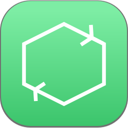
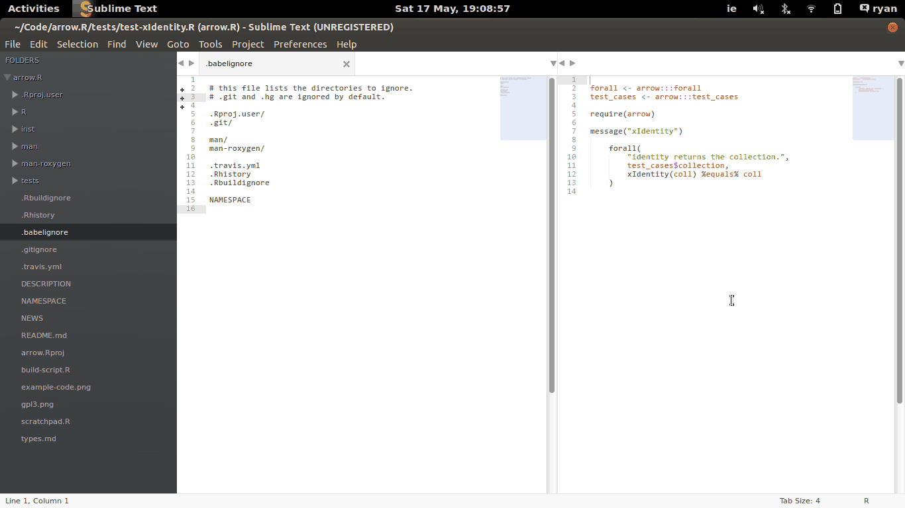

Babel v0.1.1
===========

> “Let heaven exist, though my own place be in hell. Let me be tortured and battered and annihilated, but let there be one instant, one creature, wherein thy enormous Library may find its justification.”

> - Jorge Luis Borges, The Library of Babel

Babel is a sublime text plugin to help you cope with thy enormous library. More specifically, it opens a file at random from your
open folders.

Why?

* **1**: Working on random files helps you evenly spread your time between tests, examples and features.
* **2**: Babel will let you inspect the dark-corners of your library that you would have otherwise ignored.
* **3**: Choosing random files will make you work on your favourite and not-so-favourite features.
* **4**: Reading large volumes of code is fruit for existential revelations. [1]

Babel is quite efficient for large libraries; on my mid-range laptop it takes about 0.2 seconds from pressing the shortcut to
opening the file. Future versions may be more efficient, if needed.

 </img>

## Installation

You can install Babel in several ways. The easiest is by installing [Sublime Package Manager](https://sublime.wbond.net/installation)
and then:

* 1, Press <kbd>Ctrl + Shift + p</kbd>, and navigate to 'add repository'
* 2, Drop the URL for this package - https://github.com/rgrannell1/babel - into the text field.
* 3, Now press <kbd>Ctrl + Shift + p</kbd>, navigate to 'install package', and type 'babel'.

Using this method is preferable as you will automatically recieve updates. These
followind methods will also work if you don't use Sublime Package Manager.

### Ubuntu / Linux

```bash
cd ~/.config/sublime-text-3/Packages
git clone https://github.com/rgrannell1/Babel.git
```

To upgrade run

```bash
cd ~/.config/sublime-text-3/Packages
rm -rf Babel
git clone https://github.com/rgrannell1/Babel.git
```

### OSX

```bash
cd ~/Library/Application\ Support/Sublime\ Text\ 2/Packages
git clone https://github.com/rgrannell1/Babel.git
```

To upgrade run

```bash
cd ~/Library/Application\ Support/Sublime\ Text\ 2/Packages
rm -rf Babel
git clone https://github.com/rgrannell1/Babel.git
```

### Windows

```bash
cd "%AppData%\Sublime Text 3\Packages\User"
git clone https://github.com/rgrannell1/Babel.git
```

## Shortcuts

* Jump to next random file: <kbd>Ctrl+Shift+g</kbd>

## License

Babel is released under the MIT licence.

The MIT License (MIT)

Copyright (c) 2014 Ryan Grannell

Permission is hereby granted, free of charge, to any person obtaining a copy
of this software and associated documentation files (the "Software"), to deal
in the Software without restriction, including without limitation the rights
to use, copy, modify, merge, publish, distribute, sublicense, and/or sell
copies of the Software, and to permit persons to whom the Software is
furnished to do so, subject to the following conditions:

The above copyright notice and this permission notice shall be included in all
copies or substantial portions of the Software.

THE SOFTWARE IS PROVIDED "AS IS", WITHOUT WARRANTY OF ANY KIND, EXPRESS OR
IMPLIED, INCLUDING BUT NOT LIMITED TO THE WARRANTIES OF MERCHANTABILITY,
FITNESS FOR A PARTICULAR PURPOSE AND NONINFRINGEMENT. IN NO EVENT SHALL THE
AUTHORS OR COPYRIGHT HOLDERS BE LIABLE FOR ANY CLAIM, DAMAGES OR OTHER
LIABILITY, WHETHER IN AN ACTION OF CONTRACT, TORT OR OTHERWISE, ARISING FROM,
OUT OF OR IN CONNECTION WITH THE SOFTWARE OR THE USE OR OTHER DEALINGS IN THE
SOFTWARE.

## Versioning

All versions post-release will be compliant with the Semantic Versioning 2.0.0 standard.

http://semver.org/

[1] *Code-induced epiphanies are neither guaranteed nor likely.*
